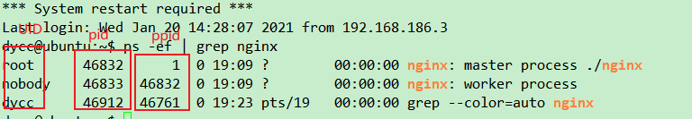

# 02. Nginx基础

## 一、nginx简介，选择理由和安装使用

### 1.1：nginx简介

nginx(2002年开发,2004年10才出现第一个版本0.1.0):web服务器，市场份额，排在第二位，Apache(1995)第一位； 
作用：web服务器，反向代理，负载均衡，邮件代理；运行时需要的系统资源比较少，所以经常被称呼为轻量级服务器；
是一个俄罗斯人（Igor Sysoev)，C语言（不是c++）开发的，并且开源了；
nginx号称并发处理百万级别的TCP连接，非常稳定，热部署（运行的时候能升级），高度模块化设计，自由许可证。
很多人开发自己的模块来增强nginx，第三方业务模块（c++开发）； OpenResty；
linux epoll技术；   windows IOCP

### 1.2：为什么选择nginx 
单机10万并发，而且同时能够保持高效的服务，epoll这种高并发技术好处就是：高并发只是占用更多内存就能做到；
内存池，进程池，线程池，事件驱动等等；
学习研究大师级的人写的代码，是一个程序开发人员能够急速进步的最佳途径；

### 1.3：安装nginx，搭建web服务器
（3.1）安装前提
a)epoll,linux 内核版本为2.6或者以上；
b)gcc编译器，g++编译器
c)pcre库：函数库；支持解析正则表达式；
d)zlib库：压缩解压缩功能
e)openssl库：ssl功能相关库，用于网站加密通讯

（3.2）nginx源码下载以及目录结构简单认识
nginx官网 http://www.nginx.org
nginx的几种版本
(1)mainline版本：版本号中间数字一般为奇数。更新快，一个月内就会发布一个新版本，最新功能，bug修复等，稳定性差一点；
(2)stable版本：稳定版，版本号中间数字一般为偶数。经过了长时间的测试，比较稳定，商业化环境中用这种版本；这种版本发布周期比较长，几个月；
(3)Legacy版本：遗产，遗留版本，以往的老版本；
安装，现在有这种二进制版本：通过命令行直接安装；
灵活：要通过编译 nginx源码手段才能把第三方模块弄进来；
```
auto / :编译相关的脚本，可执行文件configure一会会用到这些脚本
cc / : 检查编译器的脚本
lib / : 检查依赖库的脚本
os / : 检查操作系统类型的脚本
types / : 检查平台类型的脚本
CHANGES : 修复的bug，新增加的功能说明
CHANGES.ru : 俄语版CHANGES
conf / : 默认的配置文件
configure : 编译nginx之前必须先执行本脚本以生成一些必要的中间文件
contrib / : 脚本和工具，典型的是vim高亮工具
vim / : vim高亮工具
html / : 欢迎界面和错误界面相关的html文件
man / : nginx帮助文件目录
src / : nginx源码目录
core : 核心代码
event : event(事件)模块相关代码
http : http(web服务)模块相关代码
mail : 邮件模块相关代码
os : 操作系统相关代码
stream : 流处理相关代码
objs/:执行了configure生成的中间文件目录
ngx_modules.c：内容决定了我们一会编译nginx的时候有哪些模块会被编译到nginx里边来。
Makefile:执行了configure脚本产生的编译规则文件，执行make命令时用到	
（3.3）nginx的编译和安装
a)编译的第一步：用configure来进行编译之前的配置工作
./configure
--prefix：指定最终安装到的目录：默认值 /usr/local/nginx
--sbin-path：用来指定可执行文件目录：默认的是   sbin/ nginx
--conf-path：用来指定配置文件目录：默认的是  conf/nginx.conf 
b)用make来编译,生成了可执行文件   make
c)用make命令开始安装   sudo make install
```

### 1.4：nginx的启动和简单使用

启动:   sudo ./nginx
乌班图：192.168.1.128
百度：“服务器程序端口号”；
百度：“监听端口号”；
（4.1）通讯程序基础概念
a)找个人： 这个人住哪（IP地址），第二个事情是知道它叫什么（端口号）；
b)


## 二、nginx整体结构和进程模型

### 2.1 nginx的整体结构
(1.1) **master进程和worker进程概览(父子关系)**
启动nginx，看到了一个master进程，一个worker进程
ps -ef命令



第一列：UID，进程所属的用户id
第二列：进程ID（PID),用来唯一的标识一个进程
第三列：父进程ID（PPID）。 fork（），worker进程是被master进程通过fork()创建出来的-worker进程是master进程的子进程,master是父进程

**（1.2）nginx进程模型**
1个master进程，1到多个worker进程 这种工作机制来对外服务的；这种工作机制保证了 nginx能够稳定、灵活的运行；
a)master进程责任：监控进程，不处理具体业务，专门用来管理和监控worker进程；master，角色是监工，比如清闲；
b)worker进程：主要用来干活的（和用户交互）；
c)master进程和worker进程之间要通讯，可以用 信号 ，也可以用 共享内存 ；
d)稳定性，灵活性，体现之一：worker进程 一旦挂掉，那么master进程会立即fork()一个新的worker进程投入工作中去； 

**（1.3）调整worker进程数量**
worker进程几个合适呢？公认的做法： 多核计算机，就让每个worker运行在一个单独的内核上，最大限度减少CPU进程切换成本，提高系统运行效率；

物理机：4核(4个processors)；
每个物理cpu里边内核数量，是4个；core1 --core4
每个core里边有两个逻辑处理器（processors）（超线程技术/siblings)
16个processors(最细小的处理单位，即处理器个数)

`grep -c processor /proc/cpuinfo  //查看并修改虚拟机处理器个数，和windows一致，充分利用，修改 nginx.conf`

### 2.2：nginx进程模型细说
**稳定，灵活，热部署**

```bash
Options:
  -?,-h         : this help
  -v            : show version and exit
  -V            : show version and configure options then exit
  -t            : test configuration and exit
  -T            : test configuration, dump it and exit
  -q            : suppress non-error messages during configuration testing
  -s signal     : send signal to a master process: stop, quit, reopen, reload
  -p prefix     : set prefix path (default: /usr/local/nginx/)
  -c filename   : set configuration file (default: conf/nginx.conf)
  -g directives : set global directives out of configuration file
```

（2.1）nginx重载配置文件
（2.2）nginx热升级,热回滚
（2.3）nginx的关闭

stop 强制退出，quit 不再接受新的连接，处理完进行中连接后退出

（2.4）总结
nginx属多进程模型
多线程模型的弊端：共享内存,如果某个线程报错一定会影响到其他线程,最终会导致整个服务器程序崩溃；

## 三、nginx源码

### 3.1 源码学习准备

**nginx源码总述**

windows下解压：winrar

**nginx源码查看工具**
visual studio,source Insight,visual stuido Code.

主要学精通 visual Code

采用 Visual Studio Code来阅读nginx源码
Visual Studio Code:微软公司开发的一个跨平台开源的轻量级的编辑器（不要混淆vs2017:IDE集成开发环境，以编译器）；
Visual Studio Code在其中可以安装很多扩展模块；
1.30.0版本，免费的,多平台；
官方地址：https://code.visualstudio.com
https://code.visualstudio.com/download
为支持语法高亮，跳转到函数等等，可能需要安装扩展包；

**nginx源码入口函数定位**

找到main入口函数

**创建一个自己的linux下的c语言程序**
共享目录不见了，一般可能是虚拟机自带的工具 VMWare tools可能有问题；
VMWare-tools是VMware虚拟机自带的一系列的增强工具，文件共享功能就是WMWare-tools工具里边的

```bash
a)虚拟机->重新安装VMware tools
b)sudo mkdir /mnt/cdrom
c)sudo mount /dev/cdrom /mnt/cdrom
d)cd /mnt/cdrom
e)sudo cp WMwareTool....tar.gz  ../
f)cd ..
g)sudo tar -zxvf VMwareToo......tar.gz
h)cd wmware-tools-distrib
j)sudo ./vmware-install.pl
```

一路回车。

gcc编译.c，g++编译 c++
.c文件若很多，都需要编译，那么咱们就要写专门的`Makefile`来编译了；
gcc -o:用于指定最终的可执行文件名

**nginx源码怎么讲**
(1)讲与不讲，是主观的；
(2)以讲解通讯代码为主。 其他的也会涉及，创建进程，处理信号；
(3)有必要的老师带着大家看源码，解释源码；
(4)把这些nginx中的精华的源码提取出来；带着大家往新工程中增加新代码，编译，运行，讲解；入到自己的知识库，这些是加薪的筹码

### 3.2 源码学习，终端和进程

#### nginx源码学习方法
(1)简单粗暴，啃代码，比较艰苦，需要比较好的基础
(2)看书看资料,逃脱不了啃代码的过程
(3)跟着老师学，让大家用最少的力气掌握nginx中最有用的东西

架构课程前期学习两个主要任务；
(1)泛读nginx中的一些重要代码；
(2)把nginx中最重要的代码提取出来作为我们自己知识库的一部分以备将来使用；

#### 终端和进程的关系
**（2.1）终端与bash进程**
`ps -ef | grep bash`
pts(虚拟终端)，每连接一个虚拟终端到乌班图linux操作系统，就会出现 一个bash进程（shell[壳]),黑窗口，用于解释用户输入的命令
bash = shell = 命令行解释器
`whereis bash`

**（2.2）终端上的开启进程**
`ps -la`
`man ps`
随着终端的退出，这个终端上运行的进程nginx也退出了；
==可执行程序nginx是bash的子进程==；
《unix环境高级编程》第九章 进程关系；

**（2.3）进程关系进一步分析**
每个进程还属于一个进程组（一个或者多个进程的集合，每个进程组有一个唯一的进程组ID，可以调用系统函数来创建进程组、加入进程组）

“会话”(session)：是一个或者多个进程组的集合
一般，只要不进行特殊的系统函数调用，一个bash(shell)上边运行的所有程序都属于一个会话，而这个会话有一个session leader；
那么这个bash(shell)通常就是session leader; 你可以调用系统功函数创建新的session

`ps -eo pid,ppid,sid,tty,pgrp,comm | grep -E 'bash|PID|nginx'`

a)如果我 xshell终端要断开的话，系统就会发送SIGHUP信号（终端断开信号），给session leader,也就是这个bash进程
b)bash进程 收到 SIGHUP信号后，bash会把这个信号发送给session里边的所有进程，收到这个SIGHUP信号的进程的缺省动作就是退出；

**（2.4）strace工具的使用**
linux下调试分析诊断工具:可以跟踪程序执行时进程的系统调用以及所收到的信号；
a)跟踪nginx进程   :   `sudo strace -e trace=signal -p 1359`

kill(4294965937, SIGHUP)   ：发送信号SIGHUP给这个 -1359的绝对值所在的进程组；所以nginx进程就收到了SIGHUP信号
综合来讲，这个bash先发送SIGHUP给  同一个session里边的所有进程；
然后再发送SIGHUP给自己；

int abc = 4294965937; //-1359

**（2.5）终端关闭时如何让进程不退出**
设想
a)nginx进程拦截（忽略这个信号、）SIGHUP(nginx收到这个信号并告诉操作系统，我不想死，请不要把我杀死)信号，是不是可以

```cpp
#include <iostream>
#include <unistd.h>
#include <signal.h>

using namespace std;

int main() {
	cout << "hello, world..." << endl;

	signal(SIGHUP, SIG_IGN); // 忽略信号

	for(;;) {
		cout << "休息1秒." << endl;
		sleep(1);
	}	
	
	cout << "程序退出..." << endl;
	return 0;
}
```

bash进程退出，未退出子进程成为孤儿进程，被init进程领养

b)nginx进程和bash进程不再同一个seeion里；
==setsid()函数不适合进程组组长调用；==

```cpp
#include <iostream>
#include <unistd.h>
#include <signal.h>

using namespace std;

int main() {
	pid_t pid;
	cout << "hello, world" << endl;

	// signal(SIGHUP, SIG_IGN);
	
	pid = fork(); // 创建子进程，并且开始执行
	if(pid < 0) {
		cout << "fork() error." << endl;
	}
	else if(pid == 0) {
		cout << "子进程开始执行..." << endl;
		setsid();
		
		for(;;) {
            cout << "子进程休息1秒..." << endl;
            sleep(1);
		}	
		
		return 0;
	}
	else {
		for(;;) {
            cout << "父进程休息1秒..." << endl;
            sleep(1);
		}	
		
		return 0;
	}
	
	cout << "程序退出..." << endl;
	return 0;
}

```

c) setsid命令:启动一个进程，而且能够使启动的进程在一个新的session中，这样的话，终端关闭时该进程就不会退出
`setsid ./hello`

d) nohup(no hang up不要挂断）,用该命令启动的进程跟上边忽略掉SIGHUP信号，道理相同

`nohup ./hello`

该命令会把屏幕输出重新定位到当前目录的nohup.out

**（2.6）后台运行 &**

后台执行，执行这个程序的同时，你的终端能够干其他事情；你如果不用 后台执行，那么你执行这个程序后

`./hello &`

前台：你的终端就只能等这个程序完成后才能继续执行其他的操作；
==fg切换到前台==

