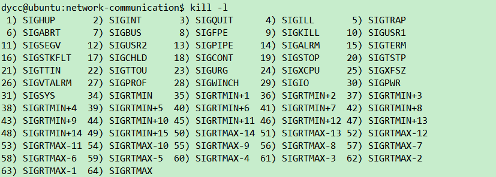

# 03. 信号及信号编程

## 一、信号的概念、认识和处理动作

### 1.1 信号的基本概念
进程之间的常用通信手段：发送信号,kill 

信号 ：通知（时间通知），用来通知某个进程发生了某一个事情
事情，信号都是突发事件，异步发生的，信号也被称呼为“软件中断”

**信号如何产生：**
a)某个进程发送给另外一个进程或者发送给自己；
b)由内核(操作系统)发送给某个进程

* b.1)通过在键盘输入命令ctrl+c[中断信号],kill命令
* b.2)内存访问异常，除数为0等等，硬件都会检测到并且通知内核；

信号名字，都是以SIG开头，SIGHUP（终端断开信号）
UNIX以及类UNIX操作系统(Linux, freebsd, solaris），支持的信号数量各不相同。10-60多个之间；

信号既有名字，其实也都是一些数字，信号是一些正整数常量；信号就是宏定义（数字，从1开始）
`#include <signal.h>  // 路径：(/usr/include/)`

gcc 
头文件，包含路径：`/usr/local/include/   /usr/include/`
库文件，连接路径：`/usr/ local/lib/      /usr/lib`

==`sudo find / -name "signal.h" | xargs grep -in "SIGHUP"`==

### 1.2 通过kill命令认识一些信号
kill :kill 进程id ,他的工作是发个信号给进程；
kill能给进程发送多种信号；

```bash
ps -eo pid,ppid,sid,tty,pgrp,comm | grep -E 'bash|PID|nginx'
sudo strace -e trace=signal -p 1184

kill -l // 查看所有信号，Linux共64个信号
```



a)单纯的用kill 进程id，那么就是往 进程发送 SIGTERM 信号（终止信号）
kill -数字 进程id，能发出跟这个数字对应的信号  -1 进程id，SIGHUP信号去

b)如果我门用kill -1 进程id，那么就是往进程发送SIGHUP终止信号；同时进程就被终止掉了；
c)kill -2 进程id，发送SIGINT信号；
kill -数字 进程id ，能发送出多种信号；

| kill的参数 | 该参数发出的信号                                             | 操作系统缺省动作                   |
| :--------: | :----------------------------------------------------------- | :--------------------------------- |
|     -1     | SIGHUP（连接断开）                                           | 终止掉进程（进程没了）             |
|     -2     | SIGINT（终端中断符，比如ctrl+c）                             | 终止掉进程（进程没了）             |
|     -3     | SIGQUIT（终端退出符，比如ctrl+\）                            | 终止掉进程（进程没了）             |
|     -9     | **SIGKILL****（终止）**                                      | 终止掉进程（进程没了）             |
|    -18     | SIGCONT（使暂停的进程继续）                                  | 忽略（进程依旧在运行不受影响）     |
|    -19     | **SIGSTOP****（停止），可用SIGCONT****继续，但任务被放到了后台** | 停止进程（**不是终止，进程还在**） |
|    -20     | SIGTSTP（终端停止符，比如ctrl+z），但任务被放到了后台，可用SIGCONT继续 | 停止进程（**不是终止，进程还在**） |

### 1.3 进程的状态
`ps -eo pid,ppid,sid,tty,pgrp,comm,stat | grep -E 'bash|PID|nginx'`
`ps aux | grep -E 'bash|PID|nginx'  //aux所谓BSD风格显示格式;`
kill只是发个信号，而不是单纯的杀死的意思。

| 状态 | 含义                                                       |
| :--: | ---------------------------------------------------------- |
|  D   | 不可中断的休眠状态(通常是I/O的进程)，可以处理信号，有 延迟 |
|  R   | 可执行状态&运行状态(在运行队列里的状态)                    |
|  S   | 可中断的休眠状态之中（等待某事件完成），可以处理信号       |
|  T   | 停止或被追踪（被作业控制信号所停止）                       |
|  Z   | 僵尸进程                                                   |
|  X   | 死掉的进程                                                 |
|  <   | 高优先级的进程                                             |
|  N   | 低优先级的进程                                             |
|  L   | 有些页被锁进内存                                           |
|  s   | Session  leader（进程的领导者），在它下面有子进程          |
|  t   | 追踪期间被调试器所停止                                     |
|  +   | 位于前台的进程组                                           |

### 1.4 常用的信号列举

| 信号名                              | 信号含义                                                     |
| :---------------------------------- | ------------------------------------------------------------ |
| SIGHUP（连接断开）                  | 是终端断开信号，如果终端接口检测到一个连接断开，发送此信号到该终端所在的会话首进程，缺省动作会导致所有相关的进程退出(上节课也重点讲了这个信号，xshell断开就有这个信号送过来)；  Kill  -1 进程号也能发送此信号给进程； |
| SIGALRM（定时器超时）               | 一般调用系统函数alarm创建定时器，定时器超时了就会这个信号；  |
| SIGINT（中断）                      | 从键盘上输入ctrl+C（中断键）【比如你进程正跑着循环干一个事】，这一ctrl+C就能打断你干的事，终止进程；  **但shell会将后台进程对该信号的处理设置为忽略（也就是说该进程若在后台运行则不会收到该信号）**； |
| SIGSEGV（无效内存）                 | 内存访问异常，除数为0等，硬件会检测到并通知内核；其实这个SEGV代表段违例（segmentation violation），你有的时候运行一个你编译出来的可执行的c程序，如果内存有问题，执行的时候就会出现这个提示； |
| SIGIO（异步I/O）                    | 通用异步I/O信号，咱们以后学通讯的时候，如果通讯套接口上有数据到达，或发生一些异步错误，内核就会通知我们这个信号； |
| SIGCHLD（子进程改变）               | 一个进程终止或者停止时，这个信号会被发送给父进程；（我们想象下nginx，worker进程终止时 master进程应该会收到内核发出的针对该信号的通知）； |
| SIGUSR1,SIGUSR2（都是用户定义信号） | 用户定义的信号，可用于应用程序，用到再说；                   |
| SIGTERM（终止）                     | 一般你通过在命令行上输入kill命令来杀一个进程的时候就会触发这个信号，收到这个信号后，你有机会退出前的处理，实现这种所谓优雅退出的效果； |
| SIGKILL（终止）                     | 不能被忽略，这是杀死任意进程的可靠方法，不能被进程本身捕捉   |
| SIGSTOP（停止）                     | 不能被忽略，使进程停止运行，可以用SIGCONT继续运行，但进程被放入到了后台 |
| SIGQUIT（终端退出符）               | 从键盘上按ctrl+\  **但shell****会将后台进程对该信号的处理设置为忽略（也就是说该进程若在后台运行则不会收到该信号）**； |
| SIGCONT（使暂停进程继续）           | 使暂停的进程继续运行                                         |
| SIGTSTP（终端停止符）               | 从键盘上按ctrl+z，进程被停止，并被放入后台，可以用SIGCONT继续运行 |

### 1.5 信号处理的相关动作

当某个信号出现时，我们可以按三种方式之一进行处理，我们称之为信号的处理或者与信号相关的动作；
(1)执行系统默认动作 ,绝大多数信号的默认动作是杀死你这个进程；
(2)忽略此信号(但是不包括SIGKILL和SIGSTOP)
kill -9 进程id，是一定能够把这个进程杀掉的；
(3)捕捉该信号：我写个处理函数，信号来的时候，我就用处理函数来处理；(但是不包括SIGKILL和SIGSTOP)

## 二、Linux体系结构，信号编程

### 2.1 Unix/Linux操作系统体系结构
类Unix操作系统体系结构分为两个状态 （1）用户态，（2）内核态
a)操作系统/内核：用来控制计算机硬件资源，提供应用程序运行的环境

我们写的程序，要么运行在用户态，要么运行在内核态。一般来讲运行在用户态，当程序要执行一些特殊代码的时候，程序就可能切换到内核态，这种切换由操作系统控制，不需要人为介入；

用户态：最外圈应用程序的活动空间；

b)系统调用：就是一些函数（系统函数），由应用程序调用；

c)shell:   bash(borne-again shell[重新装配的shell]),它是shell的一种，Linux上默认采用的是bash这种shell;

通俗一点理解，bash是一个可执行程序；主要作用是：把用户输入的命令翻译给操作系统（命令解释器）；
分隔系统调用和应用程序，有胶水的感觉；

d)用户态，内核态之间的切换
运行于用户态的进程可以执行的操作和访问的资源会受到极大限制（用户态权限小），而运行在内核态的进程可以执行任何操作并且在资源的使用上没有限制（内核态权限大）；
一个进程执行的时候，大部分时间是处于用户态下的，只有需要内核所提供的服务时才会切换到内核态，内核态做的事情完成后，又转回到用户态；

`malloc();printf();`这种状态在转换是操作系统干的，不需要人为干预；

**为什么要区分用户态，内核态；**
(1)安全性：一般情况下，程序都运行在用户态状态，权限小，不至于危害到系统其它部分；当你干一些危险的事情的时候，系统给你提供接口，让你去干；
(2)方便资源管理：既然这些接口是系统提供给你的，那么这些接口也是操作系统统一管理的，资源是有限的， 如果大家都来访问这些资源，如果不加以管理，一个是访问冲突，一个是被访问的资源如果耗尽，那系统还可能崩溃，系统提供这些接口，就是为了减少有限的资源的访问以及使用冲突；

**那么什么时候从用户态切换到内核态去呢？**
a)发生系统调用，比如调用malloc();
b)发生异常事件，比如处理信号；
c)外围设备中断，完成用户请求：

### 2.2 signal函数范例
信号来了之后，可以忽略，可以捕捉，可以用signal函数来处理；
`ps -eo pid,ppid,sid,tty,pgrp,comm | grep -E 'bash|PID|hello'`

你的进程收到了信号，这个事就会被内核注意到，内核根据信号处理该进程；

==信号缺省动作：杀掉该进程==

#### (2.1)可重入函数

==可重入函数：在信号处理程序中保证调用安全的函数，这些函数是可重入的并被称为异步信号安全的；==

有一些大家周知的函数都是不可重入的，比如`malloc()，printf();`

**在写信号处理函数的时候，要注意的事项：**
a)在信号处理函数中，尽量使用简单的语句做简单的事情，尽量不要调用系统函数以免引起麻烦； 
b)如果必须要在信号处理函数中调用一些系统函数，那么要保证在信号处理函数中调用的系统函数一定要是==可重入的==； 
c)如果必须要在信号处理函数中调用那些可能修改errno值的可重入的系统函数，那么 就得事先备份errno值，
从信号处理函数返回之前，将errno值恢复；

#### (2.2)不可重入函数的错用演示
一旦在信号处理函数中用了不可重入函数，可能导致程序错乱

`signal()`因为兼容性，可靠性等等一些历史问题；不建议使用(坚决不用)，建议用`sigaction()`函数代替

## 三、信号编程进阶，sigprocmask()范例

### 3.1 信号集
一个进程，必须能够记住这个进程当前阻塞了哪些信号
我们需要 “信号集 ”的这么一种数据结构，能够把这60多个信号都表示
`0000000000,0000000000,0000000000,00,0000000000,0000000000,0000000000,00 （64个二进制位）`
Linux 是用`sigset_t`结构类型来表示信号集的；

```c
typedef struct {
unsigned long sig[2];
}sigset_t;
```

信号集的定义：信号集表示一组信号的来（1）或者没来（0）
信号集相关的数据类型： `sigset_t`;

### 3.2 信号相关函数
a)`sigemtpyset()`:把信号集中的所有信号都清0，表示这60多个信号都没有来；
00000000000000000000000000.....
b)`sigfillset()`;把信号集中的所有信号都设置为1；
11111111111111111111111111.....
c)用`sigaddset(),sigdelset()`就可以往信号集中增加信号，或者从信号集中删除特定信号；

d)`sigprocmask,sigismember`

一个进程，会维护一个信号集，用来记录当前屏蔽（阻塞)了哪些信号；
如果将某个进程信号集中的某个信号位设置为1，就表示屏蔽了同类信号，此时再来个同类信号，那么同类信号会被屏蔽，不能传递给进程；
如果这个信号集中有很多个信号位都被设置为1，那么所有这些被设置为1的信号都是属于当前被阻塞的而不能传递到该进程的信号；
`sigprocmask()`函数，就能够设置该进程所对应的信号集中的内容；

### 3.3 sigprocmask等信号函数范例演示
**sleep()函数能够被打断：**
(1)时间到达了；
(2)来了某个信号，使sleep()提前结束，此时sleep会返回一个值，这个值就是未睡够的时间；

