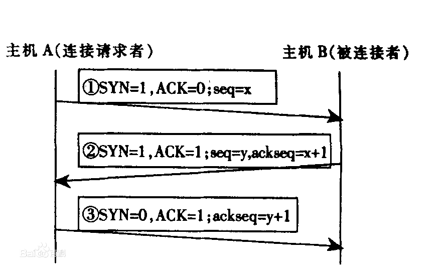
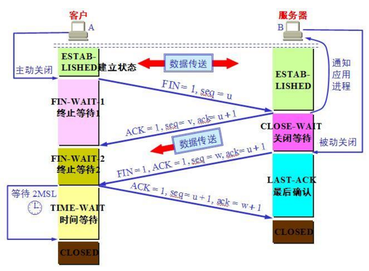

# 08. C/S模型，TCP/IP协议簇

## 一、客户端与服务器
客户端：client，一般字母c表示
服务器：server，一般字母s表示 ,所以c/s一般就是 ：客户端/服务器
客户端：就是一个程序
服务器：也是 一个程序

### 1.1 解析一个浏览器访问网页的过程

### 1.2 客户端服务器角色规律总结
a) 数据通讯总在两端进行，其中一端叫客户端，另一端叫服务器端；
b) 总有一方先泛起第一个数据包，这发起第一个数据包的这一端，就叫客户端，被动收到第一个数据包这端，叫服务器端
c) 连接建立起来，数据双向流动，双工
d) 既然服务器端是被动接收连接，那么客户端必须找到服务器位置：IP + Port
e) epoll

## 二、网络模型
### 2.1 OSI七层网络模型:
物理层 -> 数据链路层 -> 网络层 -> 传输层 -> 会话层 -> 表示层 -> 应用层

`OSI(Open System Interconnect)`：开放式系统互联；是ISO(国际标准化组织）在1985年研究的网络互联模型

### 2.2 TCP / IP协议四层模型
`Transfer Control Protocol`[传输控制协议]/`Internet Protocol`[网际协议]
tcp/ip 实际是一组协议的代名词，而不仅仅是一个协议
tcp/ip 协议，其实每一层都对应着一些协议

### 2.3 TCP / IP协议的解释和比喻
## 三、客户端和服务器程序实现代码
a) 客户端程序，服务器端程序
b) 最终`epoll`技术实现商用的服务器程序
c)《Unix网络编程》第一卷

### 3.1 套接字socket概念
套接字(socket)：就是个数字，通过调用`socket()`函数来生成，这个数字具有唯一性，直到你调用close()函数把这个数字关闭
文件描述符，一切皆文件，socket也看成是文件描述符，可以用socket来收发数据；`send(),recv()`

### 3.2 一个简单的服务器端通讯程序范例

### 3.3 IP地址简单谈
a) 写服务器程序，不用考虑 ipv4,ipv6 的问题，遵照 ipv4 规则写就行
b) 写客户端程序，只演示 ipv4 版本的客户端范例

### 3.4 一个简单的客户端通讯程序范例
c/s建立连接时双方彼此都要有 ip地址 /端口号；
连接一旦建立起来，那么双方的通讯【双工收发】，就只需要用双方彼此对应的套接字即可；

### 3.5 客户端服务器程序综合演示和调用流程图
## 四、TCP和UDP的区别
`TCP(Transfer Control Protocol)`：传输控制协议
`UDP(User Datagram Protocol)`：用户数据报协议

TCP协议：可靠的面向连接的协议，数据包丢失的话操作系统底层会感知并且重新发送数据包
UDP协议：不可靠的，无连接的协议

**优缺点**
a) tcp：可靠协议，耗费更多的系统资源确保数据传输的可靠，传输的数据保证是正确的，不丢失的，不重复的且按顺序到达对端
b) udp：不可靠协议，发送速度特别快，但无法确保数据可靠性

**各自的用途：**
a) tcp：文件传输，收发邮件需要准确率高，但效率可以相对差，一般TCP比UDP用的范围和场合更广
b) udp：qq聊天信息，DNS

## 五、TCP连接的三次握手
tcp：可靠的，面向连接的协议
udp：不可靠的，无连接的协议

### 5.1 最大传输单元MTU
`MTU(Maximum Transfer Unit)`：最大传输单元，==每个数据包包含的数据最多可以有多少个字节==（1.5K左右）

**拆包，组包**

发送100K，操作系统内部会把100K数据拆分成若干个数据包分片，每个数据包大概1.5K之内，然后对端重组，这68个包各自传送的路径可能不同，每一个包可能因为路由器，交换机原因可能被再次分片，最终TCP/IP协议保证了收发数据的顺序性和可靠性

### 5.2 TCP 包头结构

a) 源端口，目标端口
b) 关注 syn 位和 ack 位
c) 一个 tcp 数据包，是可能没有包体，此时，总会设置一些标志位来达到传输控制信息的目的

### 5.3 TCP 数据包收发之前的准备工作
**日志操作的步骤：**

a) 打开日志文件
b) 多次，反复的往日志文件中写信息
c) 关闭日志文件

**TCP数据包的收发也分三大步骤：**

a) 建立TCP连接[connect：客户端] ，三次握手
b) 多次反复的数据收发[read/wirte]
c) 关闭TCP连接[close]

### 5.4 TCP 三次握手建立连接的过程

a) 客户端给服务器发送 了一个SYN标志位置位的无包体TCP数据包，SYN被置位，就表示发起TCP链接，协议就这么定
b) 服务器收到了这个SYN标志位置位的数据包，服务器给客户端返回一个SYN和ACK标志位都被置位的无包体TCP数据包，协议就这么定的
c) 客户端收到服务器发送回来的数据包之后，再次发送ACK置位的数据包，服务器端收到这个数据包之后，客户端和服务器端的TCP链接就正式建立

### 5.5 为什么TCP握手是三次握手而不是二次
TCP之所以要三次握手，原因可能很多，但不管多少原因，都是为了确保数据稳定可靠的收发
为什么要TCP三次握手最主要的原因之一：尽量减少伪造数据包对服务器的攻击

## 六、telnet工具使用介绍
是一款命令行方式运行的客户端 TCP 通讯工具，可以连接到服务器端，往服务器端发送数据，也可以接收从服务器端发送过来的信息，该工具能够方便的测试服务器端的某个TCP端口是否通，是否能够正常收发数据，所以是一个非常实用的工具

`telnet ip port`

## 七、wireshark监控数据包
`wireshark`是个软件:分析网络数据包
https://www.wireshark.org/download.html
automatically start the WinPcap driver at boot time;

### 7.1TCP断开的四次挥手

FIN,ACK   服务器->客户端
ACK       客户端->服务器 
FIN,ACK   客户端->服务器
ACK       服务器->客户端

