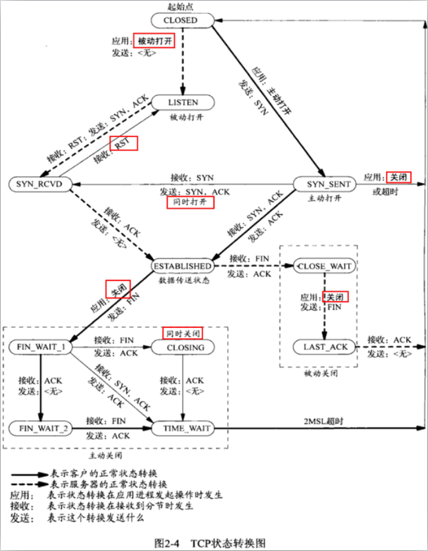

# 09. TCP状态装换，listen队列剖析

## 一、TCP状态转换，TIME_WAIT，SO_REUSEADDR

### 1.1 TCP状态转换
==相同IP地址的相同端口，只能被bind一次，第二次bind会失败==

```bash
netstat：显示网络相关信息
-a:显示所有选项
-n:能显示成数字的内容全部显示成数字
-p：显示段落这对应程序名

netstat -anp | grep -E 'State|9000'
```



只要客户端连接到服务器，并且服务器把客户端关闭，那么服务器端就会产生一条针对9000监听端口的状态`TIME_WAIT `的连接，此时， 杀掉服务器程序再重新启动，就会启动失败，`bind()`函数返回失败

`bind返回的值为-1,错误码为:98，错误信息为:Address already in use`

TCP状态转换图（11种状态） 是针对“一个TCP连接”来说的

客户端：  ` CLOSED ->SYN_SENT->ESTABLISHED【连接建立，可以进行数据收发】`
服务端：  ` CLOSED ->LISTEN->【客户端来握手】SYN_RCVD->ESTABLISHED【连接建立，可以进行数据收发】`

谁主动 close 连接，谁就会给对方发送一个FIN标志置位的一个数据包给对方

服务器主动关闭连接：`ESTABLISHED->FIN_WAIT1->FIN_WAIT2->TIME_WAIT`
客户端被动关闭：`ESTABLISHED->CLOSE_WAIT->LAST_ACK` 

### 1.2 TIME_WAIT状态
四次挥手主动方产生，具有`TIME_WAIT`状态的TCP连接，就好像一种残留的信息一样，当这种状态存在的时候，服务器程序退出并重新执行会失败，会提示：

`bind返回的值为-1,错误码为:98，错误信息为:Address already in use`

连接处于TIME_WAIT状态是有时间限制的（1-4分钟之间） = 2 MSL【最长数据包生命周期】；

**引入TIME_WAIT状态 的原因：**

==(1) 可靠的实现TCP全双工的终止==
如果服务器最后发送的ACK包因为某种原因丢失了，那么客户端一定会重新发送FIN，因为服务器端有TIME_WAIT的存在，服务器会重新发送ACK包给客户端，但是如果没有TIME_WAIT这个状态，那么无论客户端是否收到ACK包，服务器都已经关闭连接了，此时客户端重新发送FIN，服务器给回的就不是ACK包，而是RST【连接复位】包，从而使客户端没有完成正常的4次挥手，有可能造成数据包丢失。也就是说，TIME_WAIT有助于可靠的实现TCP全双工连接的终止

**RST标志**
对于每一个TCP连接，操作系统是要开辟出来一个收缓冲区和一个发送缓冲区来处理数据的收和发，当close一个TCP连接时，如果这个发送缓冲区有数据，那么操作系统会把发送缓冲区里的数据发送完毕，然后再发`FIN`包表示连接关闭。FIN是个优雅的关闭标志，表示正常的TCP连接关闭

反观RST标志：出现这个标志的包一般都表示==异常关闭==，如果发生了异常，一般都会导致丢失一些数据包，如果将来用`setsockopt(SO_LINGER)`选项要是开启，发送的就是RST包，此时发送缓冲区的数据会被丢弃。RST是异常关闭，是粗暴关闭，不是正常的四次挥手关闭，所以如果这样关闭tcp连接，主动关闭方也不会进入TIME_WAIT

==(2) 允许老的重复的TCP数据包在网络中消逝==

### 1.3 SO_REUSEADDR选项
`setsockopt（SO_REUSEADDR）`用在服务器端，`socket()`创建之后，`bind()`之前

**==`SO_REUSEADDR`的能力：==**

（1）SO_REUSEADDR允许启动一个监听服务器并捆绑其端口，即使以前建立的将端口用作他们的本地端口的连接仍旧存在，即便TIME_WAIT状态存在，服务器bind()也能成功
（2）允许同一个端口上启动同一个服务器的多个实例，只要每个实例捆绑一个不同的本地IP地址即可
（3）SO_REUSEADDR允许单个进程捆绑同一个端口到多个套接字，只要每次捆绑指定不同的本地IP地址即可
（4）SO_REUSEADDR允许完全重复的绑定：当一个IP地址和端口已经绑定到某个套接字上时，如果传输协议支持，同样的IP地址和端口还可以绑定到另一个套接字上。此特性仅支持UDP套接字[TCP不行]

==所有TCP服务器都应该指定本套接字选项，以防止当套接字处于TIME_WAIT时bind()失败的情形出现==

## 二、listen()队列剖析，阻塞非阻塞，同步异步

### 2.1 listen()队列剖析
listen()：监听端口，用在TCP连接中的服务器端角色

`int listen(int sockfd, int backlog); `

#### 2.1.1 监听套接字的队列
对于一个调用`listen()`进行监听的套接字，操作系统会给这个套接字维护两个队列

**a) 未完成连接队列 【保存连接用的】**

当客户端发送tcp连接三次握手的第一次【syn包】给服务器的时候，服务器就会在未完成队列中创建一个跟这个 syn包对应的一项，可以把这项看成是一个半连接，这个半连接的状态会从`LISTEN`变成`SYN_RCVD`状态，同时给客户端返回第二次握手包【syn,ack】，此时服务器在等待完成第三次握手

**b)已完成连接队列 【保存连接用的】**

当第三次握手完成了，这个连接就变成了`ESTABLISHED`状态，每个已经完成三次握手的客户端都放在这个队列中作为一项

==backlog曾经的含义：已完成队列和未完成队列里边条目之和不能超过 backlog==

(1) 客户端`connect()`什么时候返回，其实是收到三次握手的第二次握手包（也就是收到服务器发回来的syn/ack）之后就返回了

(2) RTT是未完成队列中任意一项在未完成队列中留存的时间，这个时间取决于客户端和服务器
对于客户端，这个RTT时间是第一次和第二次握手加起来的时间
对于服务器，这个RTT时间实际上是第二次和第三次握手加起来的时间

如果这三次握手包传递速度特别快的话，大概187毫秒能够建立起来这个连接，这个时间挺慢，所以感觉建立TCP连接的成本挺高

(3) 如果一个恶意客户，迟迟不发送三次握手的第三个包。那么这个连接就建立不起来，这个处于`SYN_RCVD`的这一项（未完成队列中），就会一直停留在服务器的未完成队列中，这个停留时间大概是75秒，如果超过这个时间，这一项会被操作系统干掉

#### 2.1.2 accept()函数
`accept()`函数，就使用来从已完成连接队列的队首位置取出来一项，返回给进程

如果已完成连接队列是空的，accept()会一直休眠，直到已完成队列中有一项时才会被唤醒，所以，从编程角度，要尽快的用accept()把已完成队列中的TCP连接取走，accept()返回的是个套接字，这个套接字就代表那个已经用三次握手建立起来的那个tcp连接

==服务器程序，必须要严格区分两个套接字：==

a) 监听9000端口这个套接字，这个套接字叫“监听套接字（listenfd）”，只要服务器程序在运行，这个套接字就应该一直存在
b) 当客户端连接进来，OS会为每个成功建立三次握手的客户端再创建一个套接字（==是一个已经连接套接字==），accept()返回的就是这种套接字，也就是从已完成连接队列中取得的一项。随后，服务器使用这个accept()返回的套接字和客户端通信的

```
(1) 如果两个队列之和【已完成连接队列，和未完成连接队列】达到了listen()所指定的第二参数，也就是说队列满了，此时，再有一个客户发送syn请求，服务器怎么反应？

服务器会忽略这个syn，不给回应, 客户端发现syn没回应，过一会会重发syn包

(2) 从连接被扔到已经完成队列中去，到accept()从已完成队列中把这个连接取出这个之间是有个时间差的，如果还没等accept()从已完成队列中把这个连接取走的时候，客户端如果发送来数据，这个数据就会被保存在已经连接的套接字的接收缓冲区里，这个缓冲区有多大，最大就能接收多少数据量
```

#### 2.1.3 syn攻击 [syn flood]
拒绝服务攻击(DOS/DDOS)，即监听队列已满，用户无法正常访问服务器

backlog：已完成连接队列中最大条目数，给300左右

开发过程中应尽快用`accept()`把已完成队列里边的连接取走，尽快留出空闲为止给后续的已完成三路握手的条目用，那么这个已完成队列一般不会满

### 2.2 阻塞与非阻塞I/O
**a) 阻塞I/O**

调用一个函数，这个函数就卡在在这里，主流程停止执行，等待某个事情发生，只有这个事情发生了，这个函数才会继续执行，这种函数，就认为是阻塞函数，例如`accept()`。这种阻塞，并不好，效率很低,一般不会用阻塞方式来写服务器程序，效率较低

**b) 非阻塞I/O：不会阻塞，充分利用时间片，执行效率更高；**

非阻塞模式的两个鲜明特点：

(1) 不断的调用`accept(), recvfrom()`函数来检查有没有数据到来，如果没有，函数会返回一个特殊的错误标记，这种标记可能是`EWULDBLOCK`，也可能是`EAGAIN`，如果数据没到来，那么这里有机会执行其他函数，但是也得不停的再次调用`accept(),recvfrom()`来检查数据是否到来
(2) 如果数据到来，那么就会阻塞把数据从==内核缓冲区复制到用户缓冲区==复制这个阶段是阻塞完成的

### 2.3 同步与异步I/O
**a) 异步I/O**

调用一个异步I/O函数时，给这个函数指定一个接收缓冲区，还要给定一个回调函数。调用完一个异步I/O函数后，该函数会立即返回。 其余判断交给操作系统，操作系统会判断数据是否到来，如果数据到来了，操作系统会把数据拷贝到提供的缓冲区里，然后调用指定的回调函数通知调用者

==区别非阻塞和异步I/O的差别：==
（1）非阻塞I/O要不停的调用I/O函数来检查数据是否来，如果数据来了，就得卡在I/O函数这里把数据从内核缓冲区复制到用户缓冲区，然后这个函数才能返回
（2）异步I/O根本不需要不停的调用I/O函数来检查数据是否到来，只需要调用一次，然后就可以干别的事情去了。内核判断数据到来，拷贝数据到提供的缓冲区，调用回调函数来通知，并不会阻塞

**b) 同步I/O**

`select(), poll(), epoll()`
1) 调用select()判断有没有数据，有数据，继续执行，没数据则阻塞
2) select()返回之后，用recvfrom()去取数据，取数据的时候也会阻塞一下

同步I/O和阻塞式I/O比，就是所谓的==I/O复用（用两个函数来收数据的优势）== 能力

所谓I/O复用，就是多个socket可以弄成一堆，可以用select这种同步I/O函数在这等数据。select()的能力是等多条TCP连接上的任意一条有数据来，然后哪条TCP有数据来，再用具体的比如recvfrom()去接受数据。所以，这种调用一个函数能够判断一堆TCP连接是否来数据的这种能力，叫`I/O multiplexing`

可以将阻塞I/O，非阻塞I/O，同步I/O归结为一类 ，因为他们多多少少的都有阻塞的行为发生，甚至有的资料直接就把阻塞I/O，非阻塞I/O都归结为同步I/O模型，而把异步I/O单独归结为一类，因为异步I/O是真正的没有阻塞行为发生的


