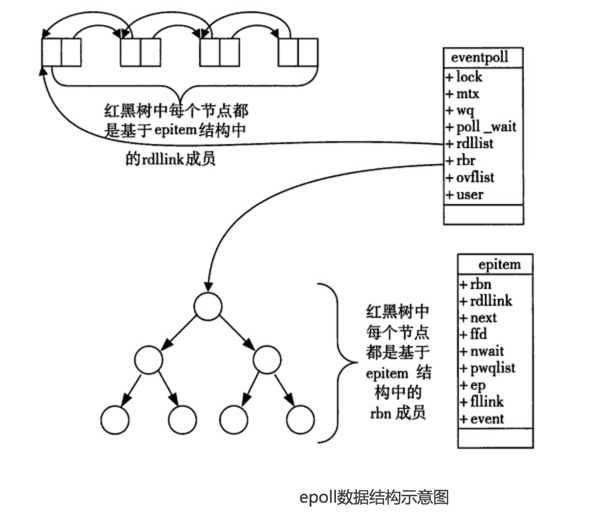

# 10. epoll()介绍及原理解析

## 一、监听端口
开启监听端口

## 二、epoll技术简介
### 2.1 epoll概述
(1) I/O多路复用：epoll就是一种典型的I/O多路复用技术，epoll技术的最大特点是支持高并发
传统多路复用技术select，poll，在并发量达到1000-2000，性能就会明显下降

```cpp
epoll(),kqueue(freebsd)
epoll() 	// 从linux内核2.6引入的，2.6之前是没有的
```

(2) epoll和kquene技术类似：单独一台计算机支撑少则数万，多则数十上百万并发连接的核心技术。epoll技术完全没有这种性能会随着并发量提高而出现明显下降的问题。但是并发每增加一个，必定要消耗一定的内存去保存这个连接相关的数据。并发量总是有限制的，不可能是无限的

(3) 10万个连接同一时刻，可能只有几十上百个客户端给你发送数据，epoll只处理这几十上百个客户端

(4) 很多服务器程序用多进程，每一个进程对应一个连接，也有用多线程的，每一个线程对应一个连接。epoll是==事件驱动机制==，在单独的进程或者单独的线程里运行收集/处理事件，没有进程/线程之间切换的消耗，效率很高

(5) 适合高并发

### 2.2 学习epoll要达到的效果及一些说明
(1) 理解epoll的工作原理，面试考epoll技术的工作原理
(2) 开始写代码
(3) 认可nginx epoll部分源码，并且能复用的尽量复用
(4) 继续贯彻用啥讲啥的原则，少就是多，慢就是快

## 三、epoll原理与函数介绍

### 3.1 课件介绍
```c
	https://github.com/wangbojing
a) 	c1000k_test这里，测试百万并发的一些测试程序；一般以main()
b) 	ntytcp：nty_epoll_inner.h，nty_epoll_rb.c
	epoll_create();
	epoll_ctl();
	epoll_wait();
	epoll_event_callback()
```

### 3.2 epoll_create()函数
格式：`int epoll_create(int size);`

功能：创建一个epoll对象，返回该对象的描述符【文件描述符】，这个描述符就代表这个epoll对象，后续会用到，这个epoll对象最终要用close(),因为文件描述符/句柄总是关闭的，size是大于零的

**原理：**
a) `struct eventpoll *ep = (struct eventpoll*)calloc(1, sizeof(struct eventpoll)); `
b) `rbr`结构成员：代表一颗红黑树的根节点[刚开始指向空]。红黑树，用来保存键值对，可以快速查找
c) `rdlist`结构成员：代表一个双向链表的表头指针。双向链表：遍历元素效率特别高
d) 总结：创建了一个`eventpoll`结构对象，被系统保存起来，rbr成员被初始化成指向一颗红黑树的根，rdlist成员被初始化成指向一个双向链表的根



### 3.3 epoll_ctl()函数
格式：`int epoll_ctl(int efpd,int op,int sockid,struct epoll_event *event);`

功能：把一个socket以及这个socket相关的事件添加到这个epoll对象描述符中去，目的就是通过这个epoll对象来监视这个socket【客户端的TCP连接】上数据的来往情况，当有数据来往时，系统会通知我们。将要监控的事件通过`epoll_ctll()`添加到系统，当这些事件来的时候，系统会通知我们

`efpd`：epoll_create()返回的epoll对象描述符
`op`：动作，添加/删除/修改 ，对应数字是1,2,3，`EPOLL_CTL_ADD, EPOLL_CTL_DEL ,EPOLL_CTL_MOD`
`EPOLL_CTL_ADD`添加事件：往红黑树上添加一个节点，每个客户端连入服务器后，服务器都会产生一个对应的socket，每个连接这个socket值都不重复。所以，这个socket就是红黑树中的key，把这个节点添加到红黑树上去

`EPOLL_CTL_MOD`：修改事件，用了EPOLL_CTL_ADD把节点添加到红黑树上之后，才存在修改

`EPOLL_CTL_DEL`：是从红黑树上把这个节点干掉，这会导致这个socket上无法收到任何系统通知事件
`sockid`：表示客户端连接，就是从accept()接受的文件描述符，这个是红黑树里边的key
`event`：事件信息，这里包括的是 一些事件信息；EPOLL_CTL_ADD和EPOLL_CTL_MOD都要用到这个event参数里边的事件信息

**原理：**

a) `epi = (struct epitem*)calloc(1, sizeof(struct epitem));`
b) `epi = RB_INSERT(_epoll_rb_socket, &ep->rbr, epi);` 【EPOLL_CTL_ADD】增加节点到红黑树中
`epitem.rbn` ，代表三个指针，分别指向红黑树的左子树，右子树，父亲
`epi = RB_REMOVE(_epoll_rb_socket, &ep->rbr, epi);`【EPOLL_CTL_DEL】，从红黑树中把节点干掉
`EPOLL_CTL_MOD`，找到红黑树节点，修改这个节点中的内容

红黑树的节点是`epoll_ctl[EPOLL_CTL_ADD]`往里增加的节点
红黑树的节点是`epoll_ctl[EPOLL_CTL_DEL]`删除的

总结：
`EPOLL_CTL_ADD`：等价于往红黑树中增加节点
`EPOLL_CTL_DEL`：等价于从红黑树中删除节点
`EPOLL_CTL_MOD`：等价于修改已有的红黑树的节点

当事件发生，我们如何拿到操作系统的通知；
### 3.4 epoll_wait()函数
格式：`int epoll_wait(int epfd,struct epoll_event *events,int maxevents,int timeout);`
功能：阻塞一小段时间并等待事件发生，返回事件集合，也就是获取内核的事件通知，就是遍历这个双向链表，把这个双向链表里边的节点数据拷贝出去，拷贝完毕的就从双向链表里移除

因为==双向链表里记录的是所有有数据/有事件的socket（TCP连接）==
参数epfd：是epoll_create()返回的epoll对象描述符
参数events：是内存，也是数组，长度是maxevents，表示此次epoll_wait调用可以收集的maxevents个已经就绪的读写事件，就是返回的是实际发生事件的tcp连接数目
参数timeout：阻塞等待的时长

==epitem结构设计的高明之处：既能够作为红黑树中的节点，又能够作为双向链表中的节点==

### 3.5 内核向双向链表增加节点
一般有四种情况，会使操作系统把节点插到双向链表中：

a) 客户端完成三路握手，服务器要accept()
b) 当客户端关闭连接，服务器也要调用close()关闭
c) 客户端发送数据来的，服务器要调用read(),recv()函数来收数据
d) 当可以发送数据时，服务武器可以调用send(),write()

### 3.6 源码阅读额外说明


